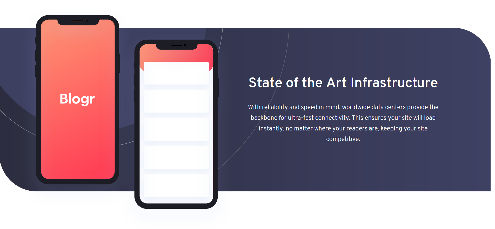
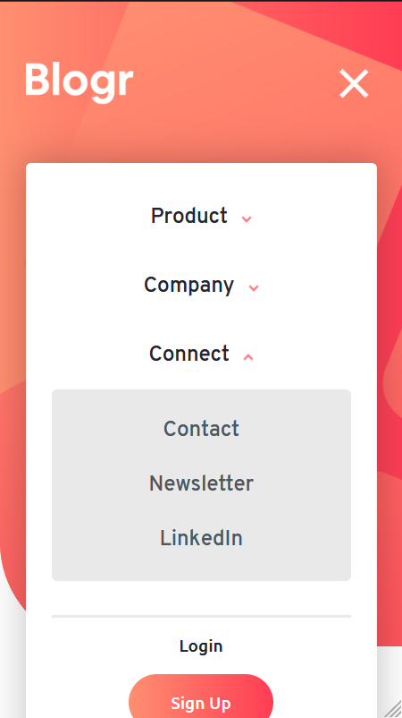
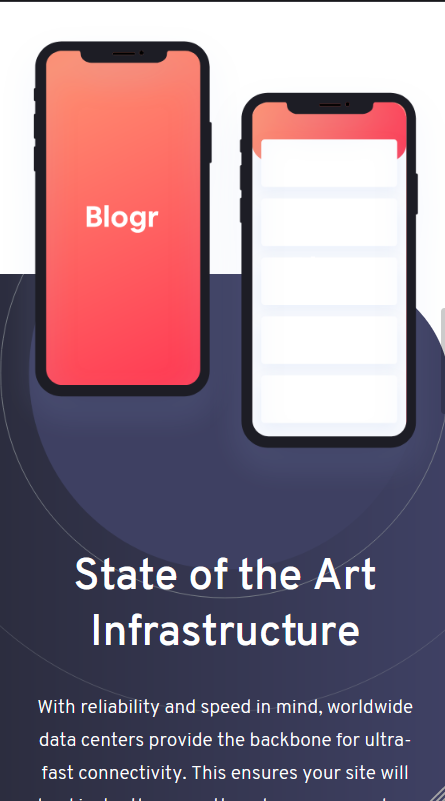

# Frontend Mentor - Blogr landing page solution

This is my solution to the [Blogr landing page challenge on Frontend Mentor](https://www.frontendmentor.io/challenges/blogr-landing-page-EX2RLAApP).

## Table of contents

-   [Overview](#overview)
    -   [The challenge](#the-challenge)
    -   [Screenshot](#screenshot)
    -   [Links](#links)
-   [My process](#my-process)
    -   [Built with](#built-with)
    -   [What I learned](#what-i-learned)
    -   [Continued development](#continued-development)
    -   [Useful resources](#useful-resources)
-   [Author](#author)
-   [Acknowledgments](#acknowledgments)

## Overview

### The challenge

Users should be able to:

-   View the optimal layout for the site depending on their device's screen size
-   See hover states for all interactive elements on the page

### Screenshots

### Links

-   [Solution Source Code](https://github.com/Ivan-Denisovich-py/fem-projects/tree/main/blogr-landing-page-main)
-   [Live Site](https://ivan-denisovich-py.github.io/fem-projects/blogr-landing-page-main)

## My process

I generally do the whole HTML markup first and then style it, from top to bottom, one by one. This time I decided to take a different approach that I saw [Jessica Chan](https://www.youtube.com/thecodercoder) do in her FEM projects. I conclude that it's a better a better way to do, in my humble opinion, stylings. This is also my first time working with Sass. I still use the old syntax, however. Yes, the `@import` stuff that everyone finds old nowadays.

After I finished styling a particular section, I would stop and add the required scripts for the interactive features.

I worked especially very hard on the hamburger menu with the accordion dropdown sections. My goal was not to use any libraries whatsoever. So it took me a while to find the best way of doing it, as well as other stuff.

After finishing more or less the whole page my goal was to add some other little details, particularly some fun parallax effects (not too much though, because honestly, I find too much parallax effect annoying). However, as I mentioned before, I'm using vanilla JS only and I didn't want to use any parallax libraries. In my head, it was theoretically easy enough to do. To my surprise, when I was researching what exactly to do, I stumbled upon the fact that literally no one bothers to do parallax in vanilla. I even saw a [Stack Overflow Question](https://stackoverflow.com/questions/48999925/how-to-make-a-parallax-effect-with-vanilla-javascript-es5) where one commenter said:

> firstly, what is "vanilla javascript"? secondly, there's so many libraries for parallax effect, either use one, or learn from the code in them - just a suggestion

They probably had a point but I find this very fascinating.

Coding the parallax wasn't how I thought it would be. I tried to find a generic way to make a `parallax` class and just add them in html and no matter what their position is they'd come to their original position when they are in the mid point of viewport. However, I found out that it wasn't as easy as I thought. I needed to think about it a lot. So I decided to make a parallax library for myself (or perhaps I'll make it an npm package) in the near future. For now I made a bodgy code and it looks good, so I don't really care 😶.

I look for your feedback!

### Built with

-   Semantic HTML5 markup
-   Sass
-   Flexbox
-   Mobile-first workflow
-   Vanilla JavaScript, no libraries

### Continued development

I wanna work on the parallax library and add it to this project later if I'd be bothered to even make it. I'll add it to my todo list.

### Useful resources

-   [Coder Coder](https://www.youtube.com/thecodercoder)
-   [Kevin Powell](https://www.youtube.com/kevinpowell)
-   [Brad's](https://www.youtube.com/user/TechGuyWeb) very good and compact [sass crash course](https://www.youtube.com/watch?v=nu5mdN2JIwM)

## Author

-   Links - [Bhaswar Chakraborty](https://ivan-denisovich-py.github.io/link-tree/)
-   Frontend Mentor - [@Ivan-Denisovich-py](https://www.frontendmentor.io/profile/Ivan-Denisovich-py)
-   Twitter - [@DenisovichPy](https://www.twitter.com/DenisovichPy)
